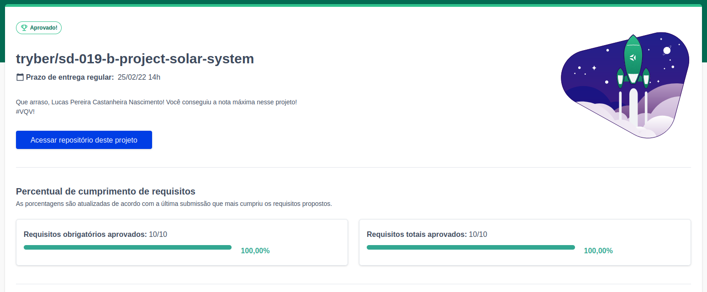
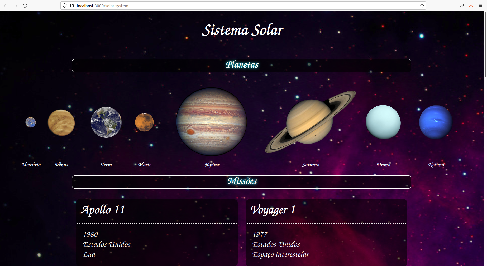

# solar-system
<h2>:brazil: Português :brazil:</h2>

Projeto entregue durante o curso de desenvolvimento Web ministrado pela <a href="https://www.betrybe.com" targe="_blank" rel="nofollow">Trybe</a>.

Obtive a aprovação no projeto completando 100% dos requisitos obrigatórios e opcionais. Efetivando, assim, a conclusão do Bloco 10 (Introdução à React) referente ao Módulo 2 (Desenvolvimento Front-end).

Descrição:
 

O projeto tinha como objetivo desenvolver uma aplicação em React com criação de componentes de classe e passagem de props. Essa aplicação simulará uma visualização do Sistema Solar, bem como informações sobre diversas missões espacias que ocorreram ao longo da história.

Habilidades desenvolvidas

<ol>
<li>Utilizar JSX no React;</li>
<li>Utilizar corretamente o método render() para renderizar seus componentes;</li>
<li>Utilizar import para trazer componentes em diferentes arquivos;</li>
<li>Criar componentes de classe em React;</li>
<li>Criar múltiplos componentes a partir de um array;</li>
<li>Fazer uso de props corretamente;</li>
<li>Fazer uso de PropTypes para validar as props de um componente.</li>
</ol>

Link para conferência: https://lucas-pcn.github.io/solar-system/

<a href="https://www.linkedin.com/in/lucas-pereira-castanheira-nascimento-238355190/" targe="_blank" rel="nofollow">Meu Linkedin</a>.

 

<h2>:us: English :us:</h2>

Project delivered during the Web development course taught by <a href="https://www.betrybe.com" targe="_blank" rel="nofollow">Trybe</a>.

I passed the project by completing 100% of mandatory and optional requirements. Thus, completing Block 10 (Introduction to React) referring to Module 2 (Front-end Development).

Description:

The project aimed to develop an application in React with the creation of class components and passing props. This application will simulate a view of the Solar System, as well as information about various space missions that have taken place throughout history.

Developed skills

<ol>
<li>Use JSX in React;</li>
<li>Correctly use the render() method to render your components;</li>
<li>Use import to bring components into different files;</li>
<li>Create class components in React;</li>
<li>Create multiple components from an array;</li>
<li>Make use of props correctly;</li>
<li>Make use of PropTypes to validate a component's props.</li>
</ol>

Conference link: https://lucas-pcn.github.io/solar-system/

<a href="https://www.linkedin.com/in/lucas-pereira-castanheira-nascimento-238355190/" targe="_blank" rel="nofollow">My Linkedin</a>.

